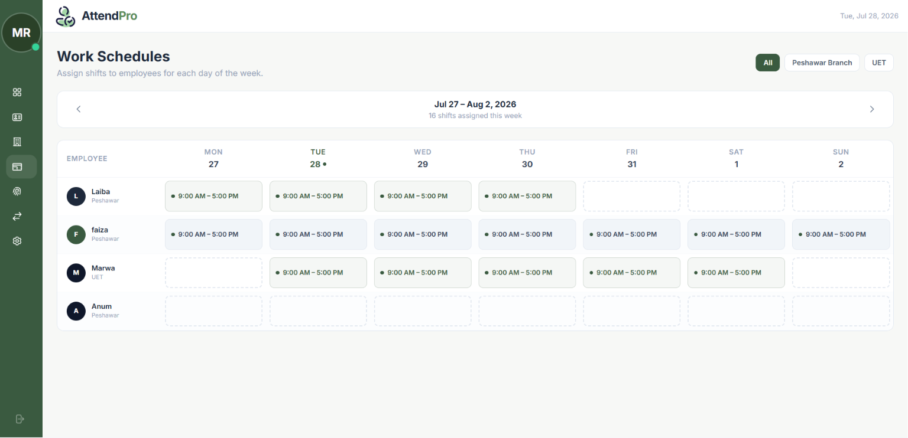
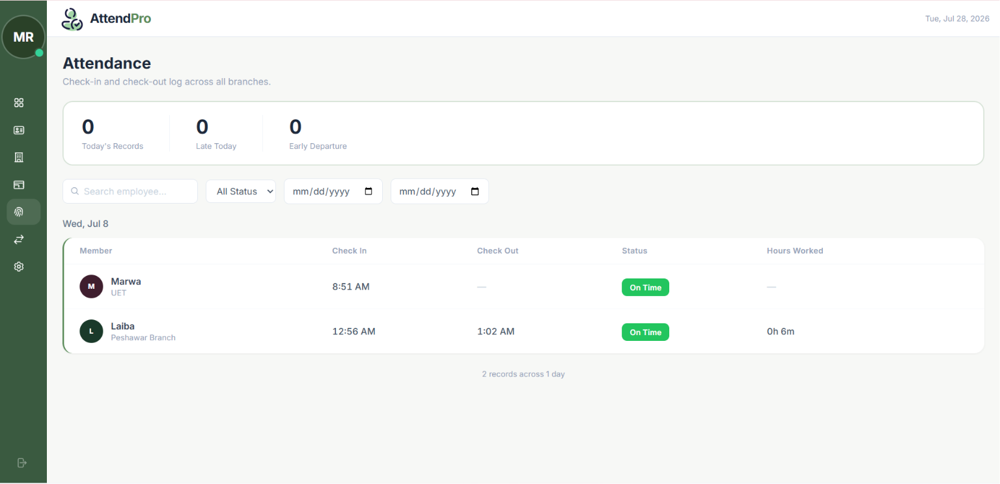
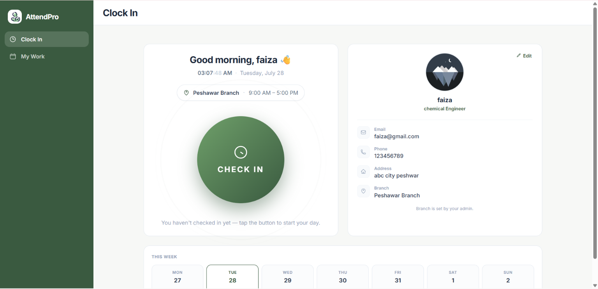

<div align="center">
  

  # AttendPro

  **GPS-verified employee attendance and shift scheduling for multi-branch businesses.**

  Employees can only clock in when they are physically inside their assigned branch —
  verified by GPS distance, not by trust.

  [Live Demo](https://attend-pro-drab.vercel.app/login) ·
  [Report a bug](https://github.com/Mahnoor592/AttendPro/issues)

  <sub>Laravel 13 · React 18 · MySQL · Tailwind CSS</sub>
</div>

---

## What it does

Traditional attendance systems trust whatever the employee submits. AttendPro doesn't — every
check-in carries GPS coordinates that are measured against the branch's real-world location before
the attendance record is accepted.

Around that core, it handles the rest of the workflow a multi-branch business actually needs:
weekly shift scheduling, employee-initiated shift change requests with an approval flow, automatic
late and early-departure detection, working-hours calculation, and an anomaly feed that surfaces
attendance problems to management without anyone having to go looking for them.

Three roles each get their own interface:

| Role | Can do |
| --- | --- |
| **Admin** | Manage branches and employees, build weekly schedules, approve/reject shift requests, review all attendance, configure system settings |
| **HR** | Read-only view of live daily attendance across branches |
| **Employee** | Check in / out, view own schedule and attendance history, submit shift change requests |

## Demo

**Live:** https://attend-pro-drab.vercel.app/login

The deployed instance runs on sample data and sign-in isn't public, since an attendance system is an
internal tool rather than something you register for. The walkthrough below covers what each role
sees — admin schedule building, attendance review, and the employee clock-in flow.

https://github.com/user-attachments/assets/a6c59a9a-58bf-40ff-b791-a6f1037ffec0

> **If the live site doesn't load, or requests fail:** the frontend is hosted on Vercel and stays up
> indefinitely, but the backend runs on Railway's free tier — once its usage allowance is spent the API
> stops responding, so the page can load fine while every request fails. Nothing is broken in the
> application itself; the walkthrough above shows it running end to end.

> **Note on location, if you run it yourself:** check-in needs the browser to share location, and the
> sample branches sit in Lahore, Karachi, and Islamabad. If you're anywhere else, check-in will reject
> you as out of range — that's the feature working, not a bug. To get a successful check-in, raise the
> `geofence_buffer` setting from the admin panel, or set a branch's coordinates to your own location.

## Screenshots

**Weekly schedule builder** — assign shifts per employee, per day, scoped to a week.



**Attendance log** — every check-in and check-out across all branches, filterable by employee, status,
and date range, with on-time/late status and hours worked per session.



**Employee clock-in** — location is captured and checked against the branch geofence before the
check-in is accepted.



## How the geofencing works

This is the part worth reading the code for — see
[`app/Services/AttendanceService.php`](backend/app/Services/AttendanceService.php).

**1. Distance is computed with the haversine formula.** Each branch stores `lat`, `lng`, and a
`radius_meters`. On check-in, the employee's submitted coordinates are compared against the branch
centre using great-circle distance, so the check stays accurate regardless of latitude:

```php
$distance      = $this->haversine($data['gps_lat'], $data['gps_lng'], $branch->lat, $branch->lng);
$buffer        = (int) Setting::get('geofence_buffer', 0);
$allowedRadius = $branch->radius_meters + $buffer;
```

**2. There's a globally configurable buffer.** GPS accuracy varies with hardware, weather, and
whether someone is indoors. Rather than hardcoding a tolerance, admins tune a `geofence_buffer`
setting that widens every branch's radius at once — useful when a whole office is getting
false rejections.

**3. Rejected attempts are recorded, not discarded.** An out-of-range check-in is written to
`attendance_logs` with `is_valid = false` and returns a `422` telling the employee exactly how far
away they are. This matters: a system that silently drops failed attempts has no way to distinguish
"nobody tried to clock in" from "somebody tried to clock in from home six times." Those rejected rows
feed the anomaly report.

**4. Check-in requires a scheduled shift.** No shift on today's schedule means no check-in — so
attendance can't accumulate against days an employee was never rostered for.

**5. Sessions are counted, not flagged.** Rather than a boolean "is checked in," the service counts
open sessions as `valid check-ins − check-outs` for the day. This allows multiple check-in/out pairs
per day (lunch breaks, split shifts) while still blocking a double check-in.

Late and early-departure flags come from comparing the timestamp against the branch's `shift_start`
and `shift_end`; working hours are computed on check-out from the matching open check-in.

## Anomaly detection

`GET /api/attendance/anomalies` builds a management feed from three signals:

- **Rejected GPS attempts** — check-ins refused for being out of range
- **Repeat lateness** — employees with 3 or more late check-ins, aggregated in SQL via `HAVING COUNT(*) >= 3`
- **Missing check-outs** — employees who checked in today and never checked out

## Design notes

**Single-tenant by design.** AttendPro is built the way workforce tools are usually deployed — one
company, one instance. Branches, employees, schedules, and settings all belong to the organisation
running it, which keeps queries straightforward and avoids carrying tenant-scoping overhead on every
table and every read.

**Accounts are provisioned by an administrator — there is no public signup.** An attendance system is
an internal tool, so letting anyone create their own account into a company's workspace doesn't make
sense: it's how you end up with strangers holding admin rights over real payroll data. There is no
registration endpoint at all. The first administrator is created by the database seeder as part of
setup, and every account after that — HR or employee — is created from the admin panel, so access is
always granted deliberately.

Supporting multiple independent companies on a single deployment would mean introducing an
organisation entity, an `organization_id` across six tables, and a global query scope enforcing
isolation on every read — plus org-scoped uniqueness on settings, and care to keep the scope off the
login path. That's a deliberate scoping trade-off rather than an oversight, and the natural next step
for the project.

## Tech stack

**Backend** — Laravel 13.8 on PHP 8.3+, MySQL, Laravel Sanctum for token auth.
Structured as Controllers → Services → API Resources, with FormRequest validation and custom
role middleware. Transactional email on shift assignment, shift updates, and shift request decisions.

**Frontend** — React 18 with React Router 7, Vite, Tailwind CSS, and Axios against the JSON API.
Role-aware layout shells and protected routes, plus custom date-range and time picker components.

**Deployment** — Frontend on Vercel with SPA rewrites; backend containerised with Docker on Railway.

## API

All routes are prefixed `/api`. Everything except login requires a Sanctum bearer token.

**Auth** — `POST /login`, `POST /logout`, `GET|PUT /me`, `PUT /me/password`, `DELETE /me`

There is deliberately no `POST /register` — see [Design notes](#design-notes).

**Employee** (`role:employee`)
```
POST /attendance/checkin      { gps_lat, gps_lng, readable_address? }
POST /attendance/checkout     { gps_lat, gps_lng, readable_address? }
GET  /attendance/mine
GET  /schedule/mine
GET  /shift-requests/mine
POST /shift-requests
```

**Admin** (`role:admin`)
```
GET|POST|PUT|DELETE  /employees, /branches
GET|POST|PUT|DELETE  /schedules
GET                  /attendance          ?employee_id&branch_id&date_from&date_to&flag
GET                  /attendance/anomalies
GET                  /dashboard
GET|PUT              /settings
GET                  /shift-requests
PUT                  /shift-requests/{id}
```

## Running locally

**Requirements:** PHP 8.3+, Composer, Node 18+, MySQL.

**Backend**

```bash
cd backend
composer install
cp .env.example .env
php artisan key:generate
```

Point the `DB_*` values in `.env` at a MySQL database, then load the schema and sample data:

```bash
mysql -u root -p attendance_db < ../database/attendance_db.sql
php artisan db:seed          # sets usable passwords on the sample users
php artisan serve            # http://localhost:8000
```

The SQL dump ships the schema plus sample branches, employees, schedules, and attendance history.

**Starting from an empty database instead?** Run `php artisan migrate` rather than importing the dump,
then `php artisan db:seed`. Since there's no public signup, the seeder is the bootstrap path — it
creates the first administrator and prints the credentials. Override them with `ADMIN_EMAIL`,
`ADMIN_PASSWORD`, and `ADMIN_NAME` in `.env` if you'd rather set your own. Log in as that admin and
create your branches and employees from the panel.

**Frontend**

```bash
cd frontend
npm install
npm run dev                  # http://localhost:5173
```

Set the API base URL in `src/api/client.js` if your backend isn't on `localhost:8000`.

## Database schema

Six core tables: `users` (with a `role` enum and nullable `branch_id`), `branches` (location,
radius, shift window), `schedules` (per-employee, per-day, scoped to a `week_start_date`),
`attendance_logs` (typed check-in/check-out rows with coordinates, validity, flag, and working
hours), `shift_requests` (change requests with an approval decision), and `settings` (key/value
configuration such as `geofence_buffer`).

Foreign keys cascade on delete, so removing a branch or employee cleans up dependent schedules and
attendance rows.

## Project layout

```
backend/
  app/Http/Controllers/    Attendance, Auth, Branch, Dashboard, Employee, Schedule, Settings, ShiftRequest
  app/Http/Requests/       FormRequest validation
  app/Http/Resources/      API response shaping
  app/Http/Middleware/     RoleMiddleware
  app/Services/            AttendanceService — geofencing, flagging, session accounting
  app/Mail/                Shift lifecycle notifications
  app/Models/              User, Branch, Schedule, AttendanceLog, ShiftRequest, Setting
  database/migrations/     Schema history
frontend/
  src/pages/admin/         Branches, Employees, Schedule, Attendance, ShiftRequests, Settings, Today
  src/pages/employee/      Today, Work, Schedule, Attendance, Requests
  src/pages/hr/            Today
  src/components/layout/   Role-aware shells
  src/api/                 Axios API modules
database/
  attendance_db.sql        Schema + sample data
```

## Author

**Mahnoor Riaz** — [GitHub](https://github.com/Mahnoor592)

Built as a database systems project, extended into a deployed full-stack application.
